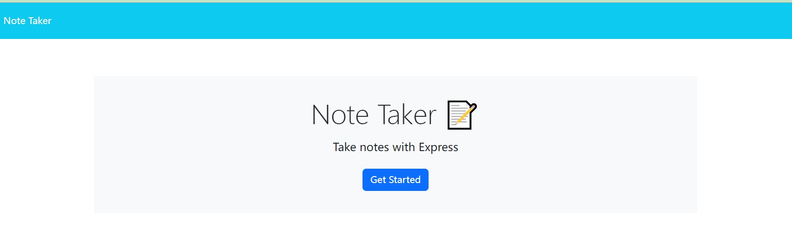
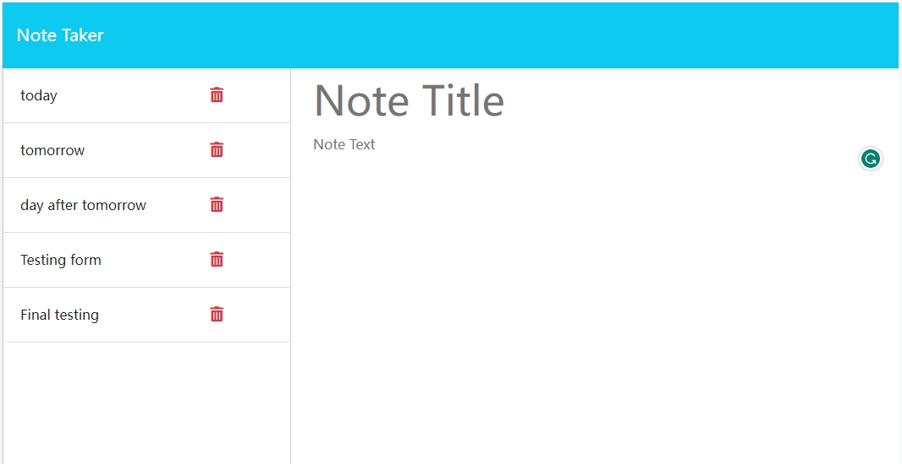
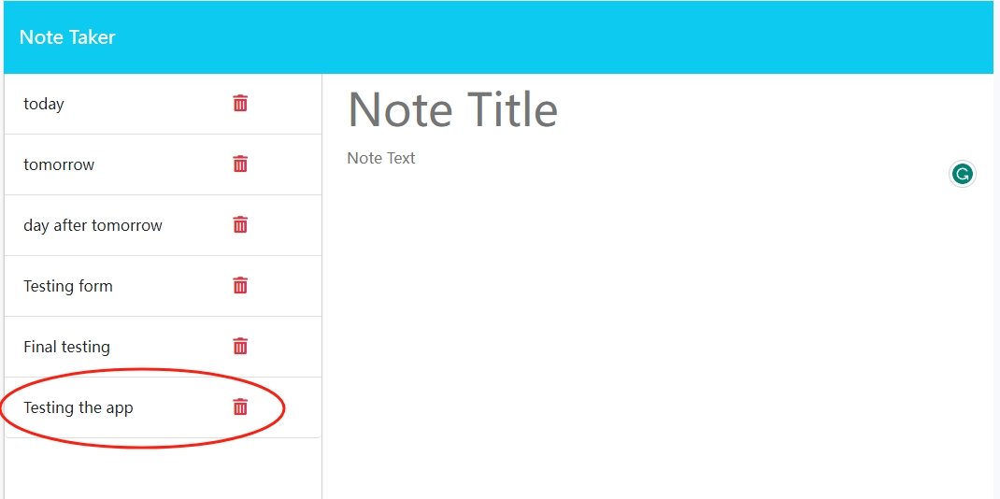
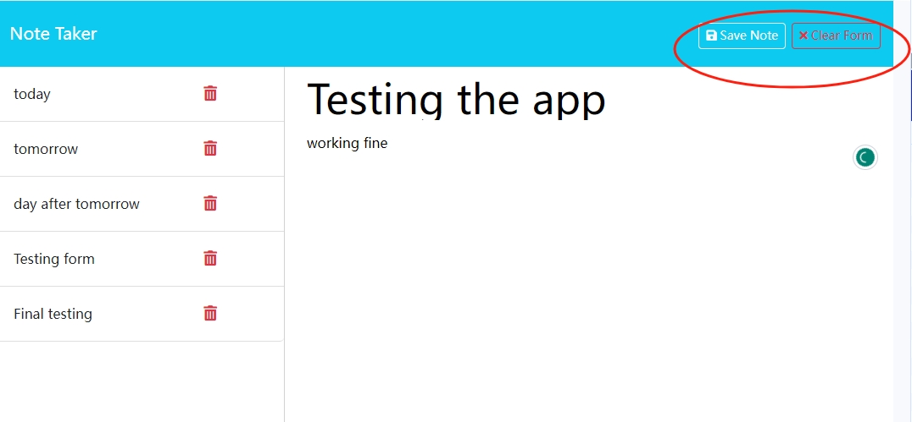
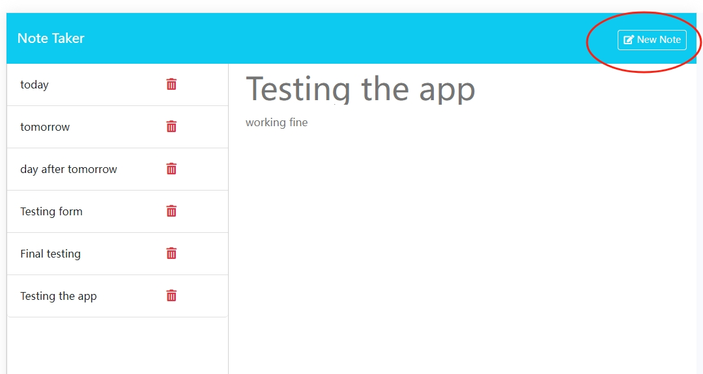
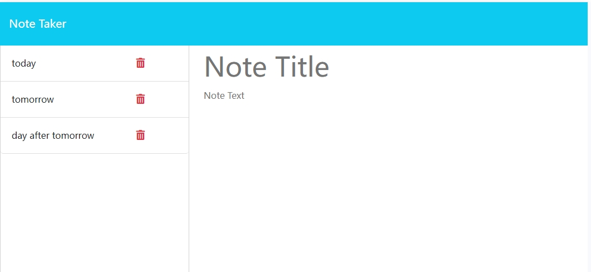

# Note Taker

## Description

a app for note taking, data stored on the server.

## Table of Contents

- [Installation](#installation)
- [Usage](#usage)
- [License](#license)
- [Contribution](#contribution)
- [Test](#test)
- [Further Questions](#furtherquestions)

## Installation

for Github repo installation:

Open the directory from VS Code.

1. install using $npm install

2. start the app by $npm start

3. open the browser and enter url "localhost:3001"

for general live url (deployed on Heroku):
1. use this link: https://fierce-island-66535-578a77698127.herokuapp.com/

## Usage

1. follow the installation steps to open the app:
  

2. click the start to open the main note taking page

  

3. you can save the notes you typed in the form, view the notes from the side list by clicking on it, delete the note that you donot want, create a new note when you need:

  
  
  
  

## License

ISC

## Contribution
You can contribute to this application by revising the codes here:  
https://github.com/mkdkck/note-taker

## Test
N/A

## FurtherQuestions

please review the codes here：  
https://github.com/mkdkck/note-taker

or contact the owner via: colin173@gmail.com

## Badges

